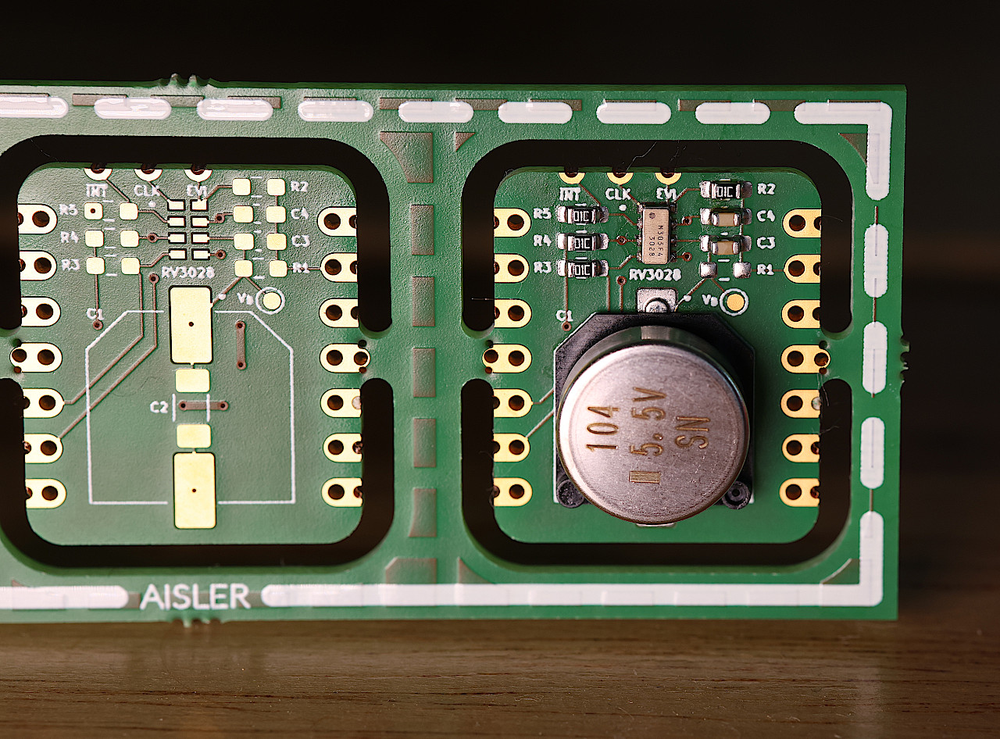

## XIAO / BFF - RTC RV3028 Add-On 

### Description

Add-On board for XIAO or QT Py boards.  
Uses an [RV3028](https://www.microcrystal.com/en/products/real-time-clock-rtc-modules/rv-3028-c7) and provides footprints for MLCC or supercapacitor VBACKUP source.

Datasheet: https://www.microcrystal.com/fileadmin/Media/Products/RTC/Datasheet/RV-3028-C7.pdf  
Application Manual: https://www.microcrystal.com/fileadmin/Media/Products/RTC/App.Manual/RV-3028-C7_App-Manual.pdf

Based on:  
https://github.com/Seeed-Studio/OPL_Kicad_Library/tree/master/Seeed%20Studio%20XIAO%20Series%20Library

Alternatives:
- https://shop.pimoroni.com/products/rv3028-real-time-clock-rtc-breakout?variant=27926940549203
- https://www.mikroe.com/rtc-8-click
- https://core-electronics.com.au/piicodev-real-time-clock-rv3028.html
- https://www.melopero.com/en/shop/melopero/meloperorv3028realtimeclockbreakoutqwiic/